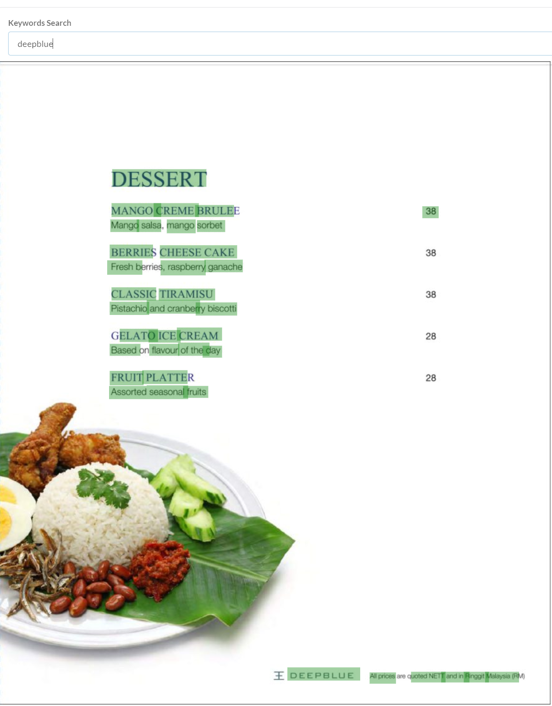
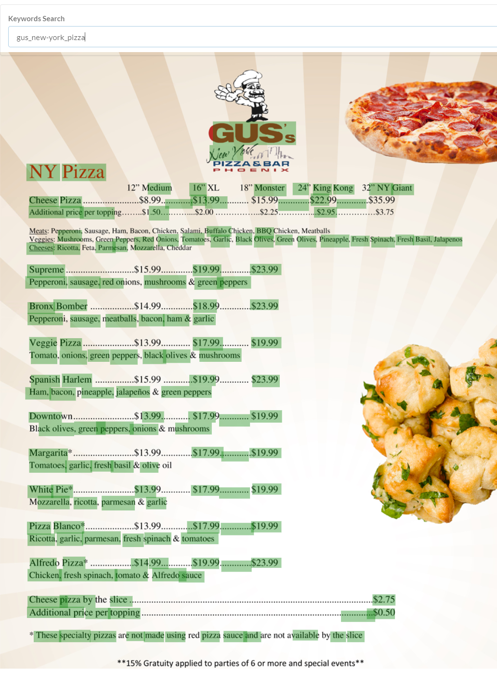

This project was bootstrapped with [Create React App](https://github.com/facebook/create-react-app).
This project is a simple web application that loads a given image, dectect the text, display the detected text on the top of image.

## Running suggestion
Please type following bash command to run:
```
git clone https://github.com/Cuilie/TextOCRProject.git
cd ./TextOCRProject
brew install node
npm install -g create-react-app
npm install
npm start
```

Issue: Now I have to used Moesif CORS chrome plugin to support fetch request. I hope to resolve this issue soon.

## Project structure
All frontend source code is available in /src.
The backend(Restful-API) and model inferencing code are available in /backend.

## Running demo
{:height="50%" width="50%"}
{:height="50%" width="50%"}
{:height="50%" width="50%"}
